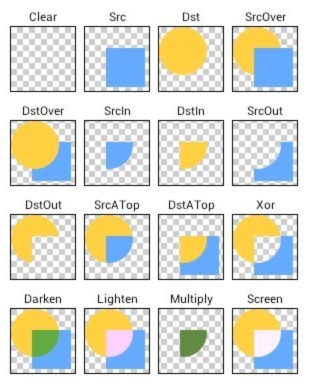

### 一、图片转换形状原理

设置Paint的Xfermode（相交模式），来设置两张图片相交时的显示方式

PorterDuffXfermode是Xfermode的子类，是一个很强大的转换模式，共有16种模式，如下图所示，其中黄色圆图为下层图片，蓝色方图为上层图片。具体可以查看Android ApiDemos，[Android Studio导入Samples方法](http://developer.android.com/intl/zh-cn/samples/index.html)



**利用这种图片相交转换方式，可以实现任意形状图片的转换**

### 二、继承BitmapTransformation自定义图片变换类

BitmapTransformation类是一个抽象类，实现了Transformation<T>接口，其中有两个方法需要重写。

```

// Transformation<T>接口中的方法，用于获取缓存的唯一标识符

String getId();

```

```

// BitmapTransformation抽象类的抽象方法，用于完成图片的转换

protected abstract Bitmap transform(BitmapPool pool, Bitmap toTransform, int outWidth, int outHeight);

```

CustomShapeTransformation.java

```

public class CustomShapeTransformation extends BitmapTransformation {

   private Paint mPaint; // 画笔
   private Context mContext;
   private int mShapeRes; // 形状的drawable资源

   public CustomShapeTransformation(Context context, int shapeRes) {
       super(context);
       mContext = context;
       mShapeRes = shapeRes;
       // 实例化Paint对象，并设置Xfermode为SRC_IN
       mPaint = new Paint();
       mPaint.setXfermode(new PorterDuffXfermode(PorterDuff.Mode.SRC_IN));
   }

   @Override
   // 复写该方法，完成图片的转换
   public Bitmap transform(BitmapPool pool, Bitmap toTransform, int outWidth, int outHeight) {
       // 获取到形状资源的Drawable对象
       Drawable shape = ContextCompat.getDrawable(mContext, mShapeRes);
       float shapeWidth = shape.getMinimumWidth(); // 形状的宽
       float shapeHeight = shape.getMinimumHeight(); // 形状的高

       int width = toTransform.getWidth(); // 图片的宽
       int height = toTransform.getHeight(); // 图片的高

       if (width > height) {
           // 如果图片的宽大于高，则以高为基准，以形状的宽高比重新设置宽度
           width = (int) (height * (shapeWidth / shapeHeight));
       } else {
           // 如果图片的宽小于等于高，则以宽为基准，以形状的宽高比重新设置高度度
           height = (int) (width * (shapeHeight / shapeWidth));
       }

       // 居中裁剪图片，调用Glide库中TransformationUtils类的centerCrop()方法完成裁剪，保证图片居中且填满
       final Bitmap toReuse = pool.get(outWidth, outHeight, toTransform.getConfig() != null
               ? toTransform.getConfig() : Bitmap.Config.ARGB_8888);
       Bitmap transformed = TransformationUtils.centerCrop(toReuse, toTransform, width, height);
       if (toReuse != null && toReuse != transformed && !pool.put(toReuse)) {
           toReuse.recycle();
       }

       // 根据算出的宽高新建Bitmap对象并设置到画布上
       Bitmap bitmap = Bitmap.createBitmap(width, height, Bitmap.Config.ARGB_8888);
       Canvas canvas = new Canvas(bitmap);
       // 设置形状的大小与图片的大小一致
       shape.setBounds(0, 0, width, height);
       // 将图片画到画布上
       shape.draw(canvas);
       // 将裁剪后的图片画得画布上
       canvas.drawBitmap(transformed, 0, 0, mPaint);

       return bitmap;
   }

   @Override
   public String getId() {
       // 用于缓存的唯一标识符
       return "CustomShapeTransformation" + mShapeRes;
   }
}

```

### 三、调用转换

```

Glide.with(this).load(url).transform(new CustomShapeTransformation).into(imageView);

// 或

Glide.with(this).load(url).bitmapTransform(new CustomShapeTransformation).into(imageView);

```

### 四、效果图
